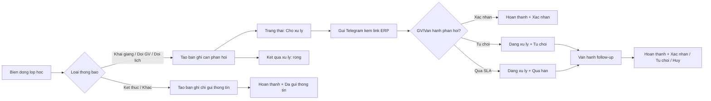

# Overview Nghiep Vu Thong Bao Giao Vien Tren ERP

## 1. Bai toan

Khi co bien dong lien quan den lop hoc nhu:

- mo lop moi
- doi giao vien
- doi lich hoc
- up/down level
- ket thuc lop

thong tin hien dang di qua nhieu buoc thu cong giua GVU, CM, Teacher Care va giao vien.

Van de chinh:

- giao vien nhan thong tin cham hoac thieu
- van hanh kho theo doi lop nao dang cho phan hoi
- khong co mot noi chot ket qua chinh thuc
- kho audit lai ai da xu ly ban ghi va xu ly ra sao

## 2. Giai phap tong quan

He thong dung ERP lam noi quan ly request thong bao giao vien.
Telegram chi dong vai tro gui thong bao va dan link vao ERP.

Moi bien dong lop hoc se tao ra mot ban ghi thong bao giao vien.
Ban ghi nay duoc theo doi tren man van hanh theo cap:

- Ma lop
- Giao vien

## 3. Hai lop thong tin nghiep vu

Day la thay doi quan trong nhat cua model moi.

### 3.1. Trang thai ban ghi

The hien ban ghi dang nam o dau trong queue:

- `Cho xu ly`
- `Dang xu ly`
- `Hoan thanh`

### 3.2. Ket qua xu ly

The hien outcome cua ban ghi:

- `Xac nhan`
- `Tu choi`
- `Huy`
- `Da gui thong tin`
- `Qua han`

Tom lai:

- `Trang thai` = dang o dau trong queue
- `Ket qua xu ly` = da duoc xu ly ra sao

## 4. Phan loai thong bao

### 4.1. Can giao vien phan hoi

- Bao lop khai giang
- Bao lop chuyen ngang
- Bao doi lich hoc

Voi nhom nay:

- Telegram gui kem link ERP
- giao vien vao ERP de xac nhan hoac tu choi

### 4.2. Chi gui thong tin

- Bao lop ket thuc
- Khac

Voi nhom nay:

- he thong chi gui Telegram
- khong hien thi trong man giao vien
- ket qua xu ly mac dinh la `Da gui thong tin`

## 5. Rule nguon phat sinh

Nguon chi gom 2 gia tri:

- `GVU`
- `CM`

Rule:

- chua co buoi hoc dau tien -> `GVU`
- da co buoi hoc dau tien -> `CM`

## 6. Luong xu ly chinh

## 7. Cac rule dac biet

### 7.1. Doi giao vien khi ban ghi cu dang cho xu ly

He thong phai lam 2 viec:

1. Ban ghi cu:
   - Trang thai = `Hoan thanh`
   - Ket qua xu ly = `Huy`
2. Tao ban ghi moi cho giao vien moi:
   - Trang thai = `Cho xu ly`
   - Ket qua xu ly = rong

### 7.2. Doi lich khi ban ghi dang cho xu ly

Neu van cung cap `Ma lop + Giao vien`:

- he thong update truc tiep lich moi tren chinh ban ghi hien tai
- khong tao ban ghi moi

## 8. Man van hanh

Giao dien de xuat:

- Tab:
  - `Cho xu ly`
  - `Dang xu ly`
  - `Hoan thanh`
- Cot `Ket qua xu ly` hien thi bang tag

Action chinh:

- gui lai Telegram
- chuyen xac nhan
- chuyen tu choi
- danh dau da xu ly
- xu ly cac case qua han

## 9. Man giao vien

Chi hien thi cac ban ghi:

- can giao vien phan hoi
- dang o `Cho xu ly`

Khi giao vien vao man:

- neu con ban ghi can xu ly thi mo popup
- giao vien chon:
  - nhan lop
  - tu choi lop

Cac ban ghi da `Huy`, `Qua han`, `Tu choi`, `Da gui thong tin` chi hien thi o lich su, khong hien popup xac nhan nua.

## 10. Ket luan ngan

Giai phap moi giup tach ro:

- queue van hanh dang theo doi cai gi
- ket qua xu ly cuoi cung cua tung ban ghi la gi

Day la nen tang dung de xu ly cac case thuc te nhu:

- giao vien tu choi nhung van hanh chua follow-up xong
- ban ghi qua han SLA
- doi giao vien khi ban ghi cu van dang cho xu ly
- doi lich tren cung mot cap `Ma lop + Giao vien`
